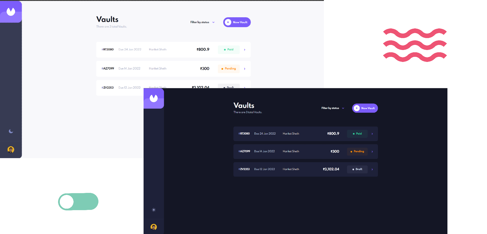

# Vault Treasure
  

<br>



## Introduction
- Used React and Next.js for `building the site`
- Formik and Yup were used for the `Forms`
- styled-components was used for styling the `components`
- Framer Motion was conviniently used for `Page transitions and animations`
- Libraries for storing the data in `Local Storage`

## Installation
> Latest Version: &nbsp;
> [](https://www.npmjs.com/package/hariket-vault)

<br>

1. Installing the Package
1.1 Use `npm install`
```
npm install hariket-vault
```
or
```
npm i hariket-vault
```

1.1 Use `yarn add`
```
yarn add hariket-vault
```

2. Installing the Dependencies
2.1 Using `npm install` after navigating to the correct directory
```
npm install
```

2.2 Or Use `yarn install` after navigating to the correct directory
```
yarn install
```

## Future Enhancements
- Planning for a Account System that works on Database such that Local Storage is not used for storing Vaults
- Password Encryption and Hashing for storing the sensitive data 
- Improving the Component segregation further for more efficiency
- Feature for exporting the vaults to different platforms and accepting further options in terms of Marking Paid

## Contribution
- Feel free to report any issue in the project. 
- Raise an `issue`, notify about the error. If you wish to propose a solution, go ahead and make your own PR to this repository
- Any further future enhancement, you wish to see can also be notified using the `ISSUES` Tab.
<br>


